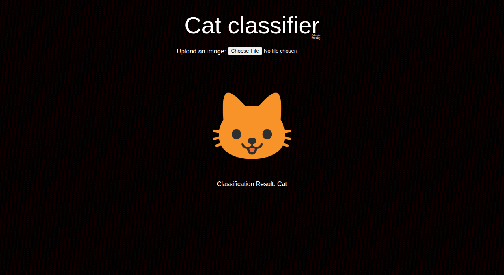

# Cat vs Non-Cat

[](https://github.com/njoppi2/cat-vs-non-cat/actions/workflows/ci.yml)
[](https://github.com/njoppi2/cat-vs-non-cat/actions/workflows/deploy-to-gh-pages.yml)
[](LICENSE)
[](https://github.com/njoppi2/cat-vs-non-cat/commits/main)

End-to-end image classification project that predicts whether an uploaded image is a cat, with notebook experiments, FastAPI serving, and a React frontend.

Live frontend: <https://njoppi2.github.io/cat-vs-non-cat/>

## Snapshot

<p align="center">
  
</p>

## Problem

Create a compact end-to-end ML app that covers model experimentation, API inference, and a simple user-facing interface for prediction.

## Tech Stack

- Python, FastAPI, TensorFlow/Keras
- React + TypeScript (Vite)
- Docker / Docker Compose
- GitHub Actions + GitHub Pages

## Repository Layout

- `deployment/`: FastAPI backend and model-serving files
- `front-end/`: React frontend
- `notebooks-and-models/`: model training and experimentation artifacts
- `.github/workflows/`: CI and deploy workflows

## Quickstart

From repository root:

```bash
docker compose up --build
```

Open:

- Frontend: `http://localhost:3000`
- API docs: `http://localhost:8000/docs`

Stop:

```bash
docker compose down
```

## Run Services Separately

Backend:

```bash
cd deployment
pip install -r requirements.txt
uvicorn app.main:app --reload
```

Frontend:

```bash
cd front-end
npm install
npm run dev
```

## Validation and CI

Local checks:

```bash
python -m compileall deployment/app
PYTHONPATH=deployment python -m unittest discover -s deployment/tests -p "test_*.py"
cd front-end && npm ci && npm run build
```

CI validates backend syntax, backend API smoke tests, and frontend build. GitHub Pages workflow publishes frontend from `front-end/dist`.

## Results

- Notebook-to-inference path is fully connected.
- Frontend is publicly accessible via GitHub Pages.
- Local Docker setup brings up both API and UI together.

## Limitations

- Model artifacts are still stored directly in the repository.
- Training is notebook-centric, not fully script-driven.
- Backend test coverage is still minimal.

## Roadmap

- Move large model binaries to Releases/LFS.
- Add reproducible training CLI pipeline.
- Add backend unit/smoke tests to CI.

## Contributing

See [CONTRIBUTING.md](CONTRIBUTING.md).
